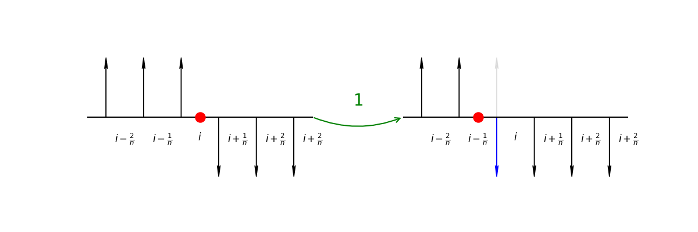
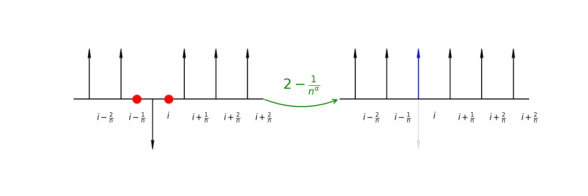
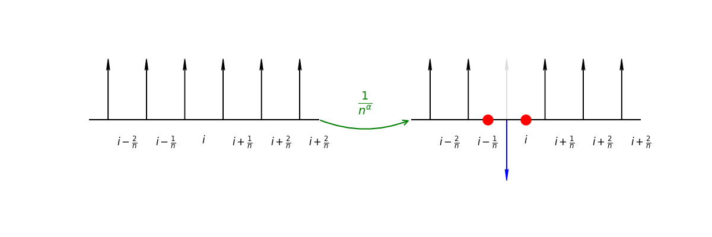
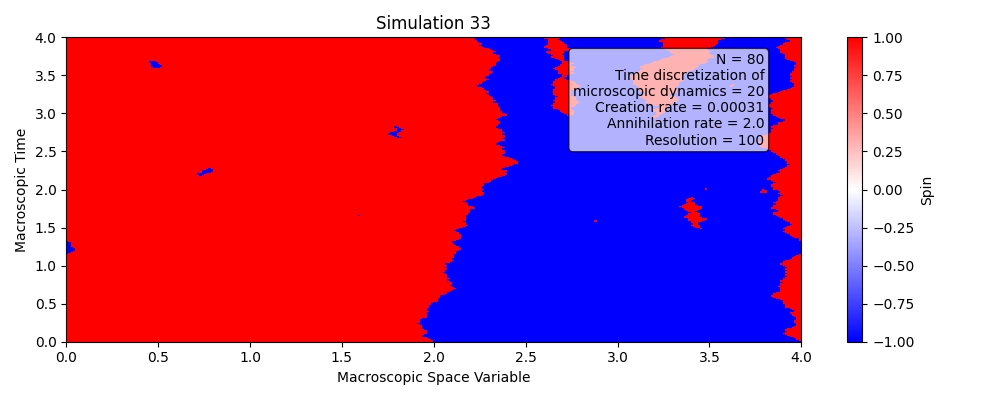

# Glauber Dynamics in the Zero-Temperature Continuum Limit

This repository explores the **zero-temperature continuum limit** of the **1-dimensional Glauber dynamics**.  
The model considers sites spaced by  $1/N$ with

 

and time is **diffusively rescaled**.

---
## 🔹 Pages

For a rendered version of the project documentation, see the [📄 GitHub Pages site](https://alessandrogubbiotti.github.io/Glauber/).

## 🔹 Description of the Dynamics

The dynamics can be described in terms of **interfaces (particles):**

- **Single interface motion:**  
  Before taking the diffusive limit, an interface moves to the right or left with rate  
  ,  
  provided no other interface is present.

  

- **Annihilation of neighboring particles:**  
  Two neighboring particles are annihilated with rate  
  .

  

- **Creation of particles:**  
  At each site, two particles are created with rate 
  .

  

---

## 🔹 Invariant Measure

The invariant measure is that of a **Poisson point process** of intensity one:

- The number of particles follows a **Poisson distribution**.  
- Particle positions are **uniformly distributed**.

Example simulation output:

---

