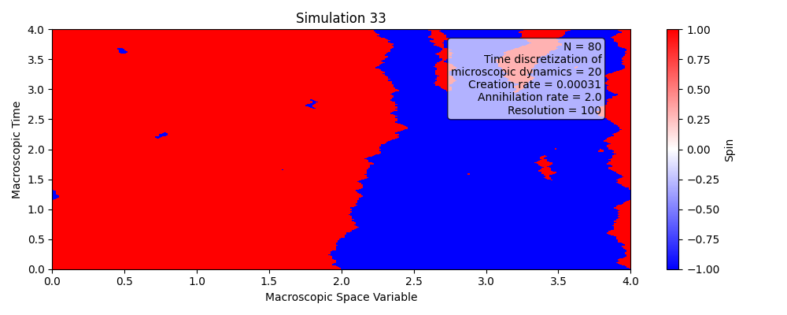

# Glauber interfaces, parametrized by (N, annihilation, creation)

This repository simulates the **1-dimensional Glauber–Ising dynamics** in its
**interface (particle) picture** and compares the finite-`N` Monte-Carlo
correlators against **exact closed-form theory**. The mathematical conventions
are fixed in [`docs/section1.pdf`](docs/section1.pdf) (Section 1 of the paper).

For the rendered documentation, see the [📄 GitHub Pages site](https://alessandrogubbiotti.github.io/Glauber/).

---

## 🔹 Primary parameters

The model is parametrized by a scaling parameter `N` and the two reaction
rates, the **annihilation rate** `ann` and the **creation rate** `create`.
The temperature parameters are *derived*:

```
gamma = (N^2 - nu^2) / (N^2 + nu^2)        beta = log(N/nu) / 2
eta   = (N - nu)     / (N + nu)            p    = nu / (N + nu)
```

On a ring of `l = N*L` bonds, in **code units** (hop rate 1 per direction):

- **Interface motion:** an isolated interface hops left or right with rate `1`
  per direction, **into empty bonds only**.
- **Annihilation:** an adjacent pair of interfaces annihilates with rate `ann`.
- **Creation:** a pair is created on each adjacent **empty** pair of bonds with
  rate `create`.

This is what [`src/interface_state.c`](src/interface_state.c) implements.

---

## 🔹 Reversibility and the intensity `nu`

The Bernoulli(`p`) bond measure is reversible iff

```
create * (1 - p)^2 = ann * p^2     <=>     p = 1 / (1 + sqrt(ann/create)).
```

The rescaled interfaces converge to a Poisson point process of intensity `nu`
iff

```
ann / create = N^2 / nu^2
```

— note the ratio is `N^2 / nu^2`, **not** `nu * N^2`. (If `ann/create = theta*N^2`
the limiting intensity is `theta^(-1/2)`.) For `nu = 1` this gives the dictionary
`e^{2*beta} = N`, `gamma = (N^2-1)/(N^2+1)`, `eta = (N-1)/(N+1)`, `p = 1/(N+1)`,
**replacing** the incorrect `N = e^{2*beta}/(1 - e^{beta})` formula used in
earlier versions of these docs.

---

## 🔹 Rate modes (`config.txt`)

```
N=20
nu=1.0
L=4
rate_mode=glauber        # glauber | scaled | explicit
slowdown_exponent=0.0
```

- **`glauber`** (default): `ann = 1 + gamma`, `create = 1 - gamma`. Then
  `ann + create = 2 = 2*hop_rate`, the condition for the correlation hierarchy
  to **close**, so the analytic formulas are exact. The `annihilation`/`creation`
  keys are ignored.
- **`scaled`**: the `glauber` rates times `pow(N, slowdown_exponent)`. Same
  invariant measure, slower reactions (the `a = -1/2, -1, -3/2` family).
- **`explicit`**: read `annihilation`/`creation` verbatim, print the implied
  `nu` and `gamma`. The legacy `(ann, create) = (2, 2/N^2)` has the right ratio
  but `ann + create = 2 + 2/N^2`, so it is only asymptotically Glauber.

The derived block (`nu, beta, gamma, eta, p_equilibrium, rate_mode, ann, create,
time_scale_formula = 2*N^2`) is written to `configuration.json` and printed in
the run banner.

---

## 🔹 Time dictionary

The engine defines macroscopic time `tau = micro_time / N^2` with hop rate 1 per
direction. The analytic formulas are in **Glauber time** (hop rate 1/2 per
direction), so they must be evaluated at

```
t_formula = 2 * N^2 * tau.
```

---

## 🔹 Building and running

```bash
bash compile_gillespie.sh      # ./Gillespie  (trajectories, statistics)
bash compile_corr2pt.sh        # ./Corr2pt    (finite-N correlators)

./Corr2pt config.txt 2000 equilibrium   # G_n, H_n  (reversible start)
./Corr2pt config.txt 2000 disordered    # C_n       (quench start)
```

`./Corr2pt` writes one tidy file per observable (`corr2pt_multi.txt` for
`G_n`, `iface_corr2pt_multi.txt` for `H_n`, `corr_eqtime_multi.txt` for the
single-time `C_n`) and then calls the theory overlay.

---

## 🔹 Exact theory and verification

- [`python_scripts/theory_glauber.py`](python_scripts/theory_glauber.py) —
  closed-form correlators on `Z` and on the finite ring, using the
  exponentially scaled Bessel functions `ive` for numerical stability.
- [`python_scripts/plot_theory_vs_mc.py`](python_scripts/plot_theory_vs_mc.py) —
  reads a results directory, overlays theory vs MC for each `T`, and prints a
  `chi^2/dof` per curve.
- [`tests/test_theory.py`](tests/test_theory.py) — checks the single-time
  Bessel-addition identity to `1e-12` and the interface plateau `H_n -> p^2`.

```bash
python tests/test_theory.py            # or: pytest tests/
```

---

## 🔹 Invariant measure

The invariant measure is a Poisson point process of intensity `nu`: the number
of particles is Poisson and the positions are uniform. Started from it (`./Corr2pt
... equilibrium`), the equal-time correlator stays at `eta^|n|` for all `T`
(stationarity).


