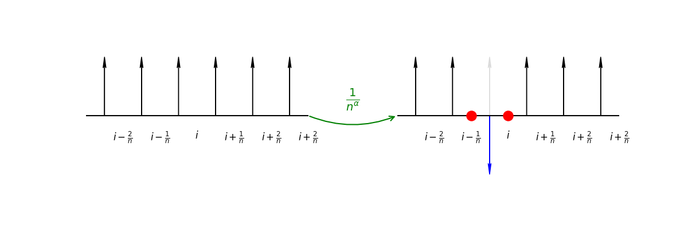
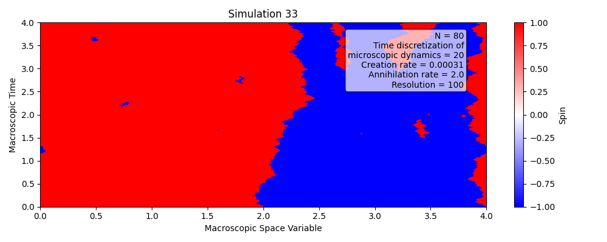

# Glauber Dynamics in the Zero-Temperature Continuum Limit

This repository explores the **zero-temperature continuum limit** of the **1-dimensional Glauber dynamics**.  
The model considers sites spaced by  
$$
\frac{1}{N}
$$  
with  
$$
N = \frac{e^{2\beta}}{1 - e^{-\beta}},
$$  
and time is **diffusively rescaled**.

---

## 🔹 Description of the Dynamics

The dynamics can be described in terms of **interfaces (particles):**

- **Single interface motion:**  
  Before taking the diffusive limit, an interface moves to the right or left with rate 1,   provided no other interface is present.

  

- **Annihilation of neighboring particles:**  
  Two neighboring particles are annihilated with rate
  $$
  2 - \frac{1}{N^a}.
  $$

  

- **Creation of particles:**  
  At each site, two particles are created with rate
  $$
  \frac{1}{N^a}.
  $$

  

---

## 🔹 Invariant Measure

The invariant measure is that of a **Poisson point process** of intensity one:

- The number of particles follows a **Poisson distribution**.  
- Particle positions are **uniformly distributed**.

Example simulation output:

---

## 🔹 Repository

For source code and further details, visit the [GitHub repository](https://github.com/alessandrogubbiotti/Glauber).

